# VRChat キメラアバター作成方法

- [VRChat キメラアバター作成方法](#vrchat-キメラアバター作成方法)
  - [環境](#環境)
  - [手順](#手順)
    - [プロジェクトのセットアップ](#プロジェクトのセットアップ)
    - [アバターのセットアップ](#アバターのセットアップ)
    - [スケール調整](#スケール調整)
    - [不要なボーンの無効化](#不要なボーンの無効化)
    - [合成](#合成)
    - [明るさ補正](#明るさ補正)
    - [FX レイヤーの修正](#fx-レイヤーの修正)
    - [顔の修正](#顔の修正)

## 環境

Unity しか使いません。なぜなら私は Blender が死ぬほど苦手だからです。

**アバターによっては規約で「すげ替え」や「パーツ取り」が禁止されている可能性があります！**  
作業前に必ず各アバターの規約を確認してください。

これと同じ要領で服の差し替え等も行えます。気が向いたら書きます。

- Windows 10 22H2 Home
- Unity 2019.4.31f1
- VCC 2.1.1
- SDK 3.2.0
- lilToon 1.4.0
- Gesture Manager 3.8.4
- Avatars 3.0 Manager 2.0.20
- 使用アバター:
  - 頭: [カリン ver1.11](https://booth.pm/ja/items/3470989)
  - 素体: [桔梗 ver1.03](https://booth.pm/ja/items/3681787)

## 手順

Assets のファイル階層や GameObject の階層は全て「**ルートを基準とした絶対パス**」で記載します。  
また，インポートしたファイル名は**全てリネームしていない事を前提としています**。インポート後にリネームした場合は適宜読み替えてください。

頭側は「カリン」，素体側は「桔梗」前提で説明します。  
おおよそ同じ手順・名称だと思いますが差異がある場合はなんかいい感じに読み替えてください。

### プロジェクトのセットアップ

通常通り VRChat Creator Companion を用いてプロジェクトを作成し，前提アセット (アバター等) のインポートをしてください。  
テストに Gesture Manager を使うためこれも導入してください。というか**ないと辛いです**。  
Modular Avatar に関しては使いたい人だけ使ってください。

### アバターのセットアップ

Assets ウィンドウより `Kikyo/Prefab/Kikyo_PB.prefab` と `Amatousagi/Karin/Karin.prefab` を Hierarchy に追加し，Unpack してください。

その後，頭側アバターに Attach されている Animator, VRC_Avatar Descriptor, Pipeline Manager を削除してください。

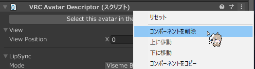

ここまで終わったら一度 Ctrl-S で Scene を保存してください。

### スケール調整

**ここでは「頭側アバター (カリンちゃん)」を「素体側アバター (桔梗ちゃん)」の体格に合わせて Scale を変更していきます**。  
頭側に合わせたい場合は本手順の「頭側」と「素体側」を**逆に読み替えて実行してください**。

Scene ウィンドウ右上「シーンギズモ」ボタンを押してアバターを真横から見るように設定してください。

カリンちゃん (Karin.prefab) を選択し，Inspector 内 Transform コンポーネントの Scale を弄って，**頭頂部の高さが桔梗ちゃんと一致するように調整します**。  
邪魔であればアバターについている帽子や耳を一度非表示にしてもいいでしょう。

頭頂部の高さが一致したら次は顎の高さと奥行きをあわせていきます。

### 不要なボーンの無効化

素体側は髪の毛などの「Head 以内のオブジェクトのボーン及び Physics Bone Component」を無効化してください。  
Delete キーで削除してしまっても構いませんが，**後のリカバリーが非常に面倒になります。**[^1]  
Inspector からチェックを外した後，Tag を EditorOnly にしてください。

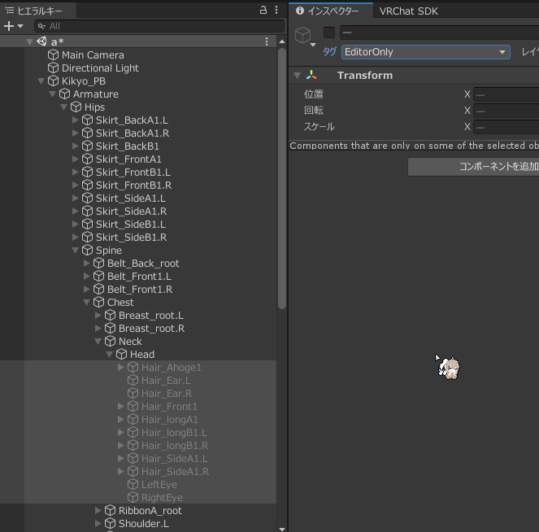

頭側は逆に服などの「Head 以外のオブジェクトのボーン及び Physics Bone Component」を無効化してください。  
こちらは殆どのボーンを削除しても問題ありません。ボーン構造と Prefab 構造が画像のようになっていれば OK です。

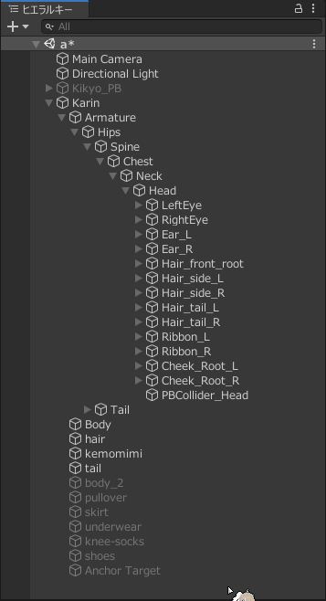

尻尾が不要な場合は Neck (Head) 以外削除でも OK ですが，後から尻尾を足したくなった場合は別途で尻尾だけ移植する必要があります。[^2]

### 合成

素体側にある「Body」の名称を適当な物に変更して非表示にし，EditorOnly に設定してください。

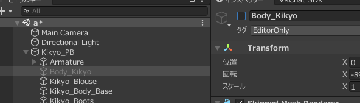

その後，頭側のアバター本体をそのまま素体側アバター直下に配置し，頭側の「Body」を素体側に移動してください。

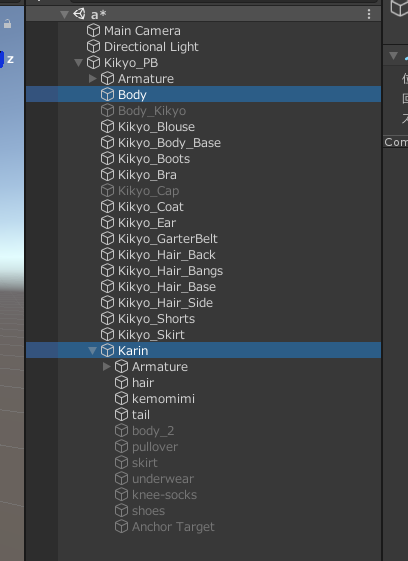

素体側アバターの髪の毛や帽子などのオブジェクトも非表示にしてください。

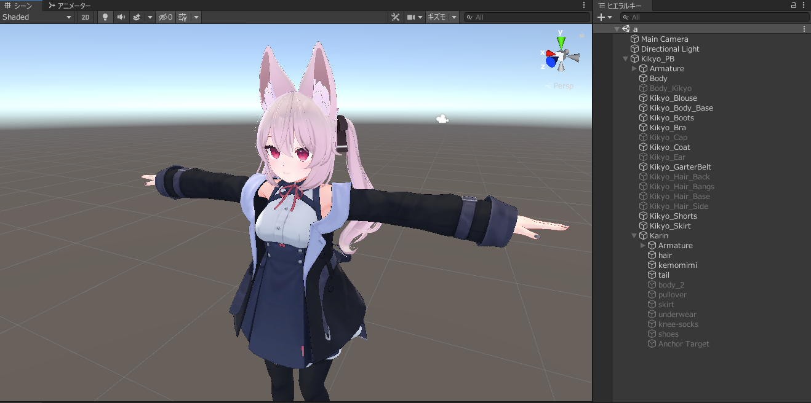

次に素体側の素体メッシュのテクスチャの色味を (おおよそ) 頭の色味に合わせていきます。  
素体オブジェクトを選択し，lilToon の設定「メインカラー/透過設定」を開き，「色調補正」の折りたたみを開き，  
中にあるパラメーターを調整して，**「首の継ぎ目」と色が合うように調整してください**。[^3]

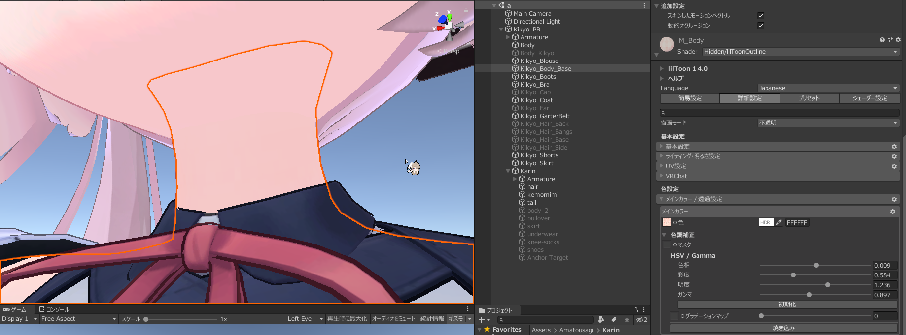

調整が終わったら下にある「焼き込み」ボタンを押して保存すれば完了です。  
輪郭線などにセットされているテクスチャも必要に応じて差し替えてください (差し替えた方が VRAM 的には優しいです) 。

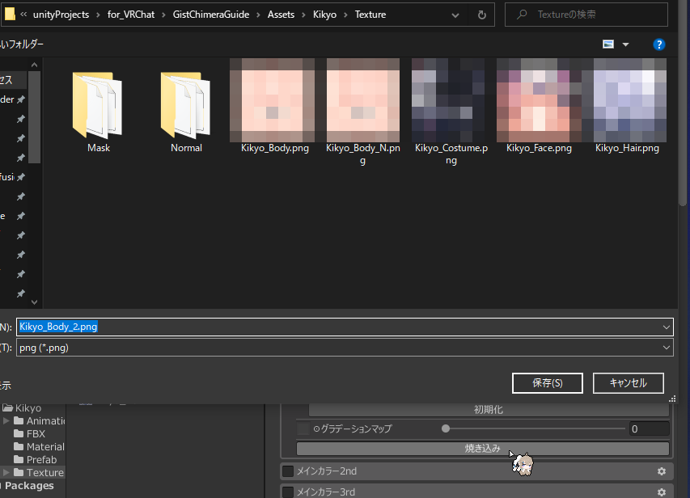

次に Root Bone を変更します。  
移植した頭側アバターのメッシュ全てを選択し，Inspector ちょっと下にある「Root Bone」を素体アバターの Root Bone (多くの場合 Hips)に変更してください。

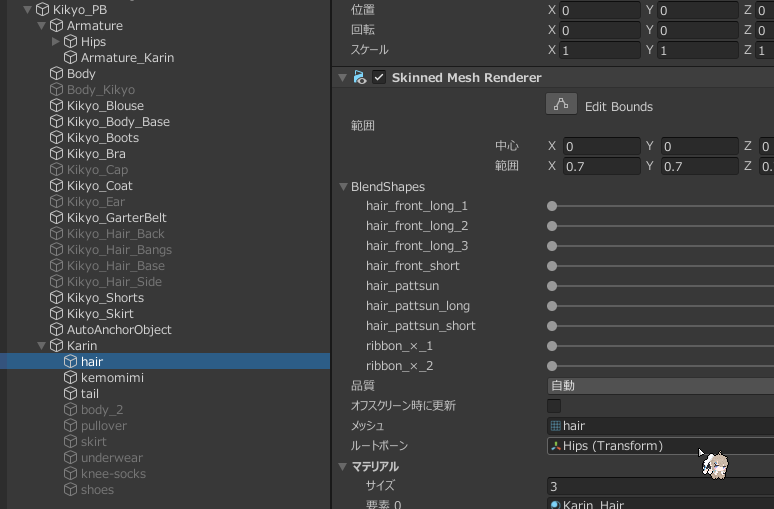

最後に尻尾や各種ボーンを移植します。  
頭側 Armature 以下のオブジェクト全てに何らかの方法で固有の名称を付け，**素体側 Armature と入れ子構造にしてください** (通常の着せ替えと同様の手順です) 。

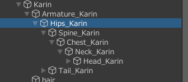

必要に応じて尻尾の位置を調整したら合成は完了です。**お疲れ様でした！**

### 明るさ補正

現在，**アバターの頭と素体で明るさに差異が出る状態になっています。**  
この問題を修正するために lilToon の明るさ修正機能を使用します。

アバターを右クリックし，「lilToon > [GameObject] Fix lighting」をクリックしてください。

これで完了です。

以下 lilToon 1.4.0 [固有の不具合](https://github.com/lilxyzw/lilToon/issues/92)への対応策です。修正されたら消します。  
もし「AutoAnchorObject」がアバターの外に出ている場合は手動でアバターのルートに移動した後，全メッシュを選択して「Anchor Override」を先程入れた「AutoAnchorObject」に変更してください。

### FX レイヤーの修正

現在，**表情が破壊されて機能していない状態になっています** (Gesture Manager などで試せば分かります) 。  
この問題を修正するために FX レイヤーの表情アニメーションステートを修正していきます。

Project ウィンドウで頭側アバターの表情コントローラーの場所まで移動します。  
今回は `Amatousagi/Karin/Animations/Controllers` です。  
中にある `Karin_FX.controller` を開き，Left あるいは Right Hand レイヤーの各表情ステートに割り振られているアニメーションファイル名を控えてください。

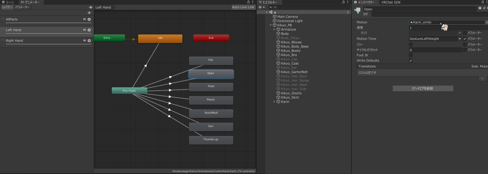

控えた後，どれか適当なアニメーションをクリックし， Project ウィンドウ横の鍵マークをクリックして固定してください。

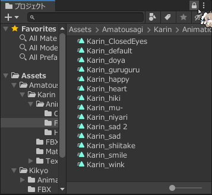

次にアバターの FX レイヤーを開きます。素体アバターのルートから FX レイヤーをダブルクリックする事で開けます。

表情アニメーションステートを頭側アバターのアニメーションに差し替えてください。  
目閉じが Fist に割り当てられており，それのみ BlendTree になってる場合は BlendTree をダブルクリックして開き，目閉じアニメーションを対応するアニメーションに差し替えてください。

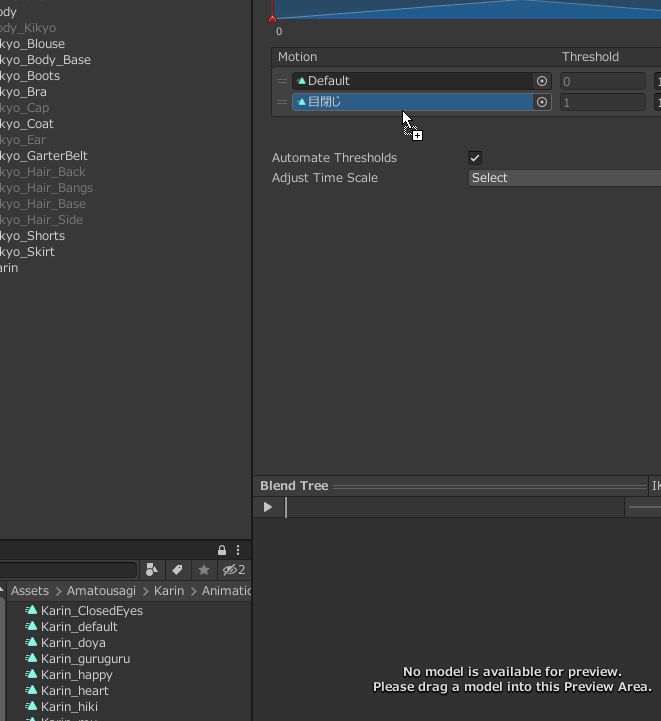

差し替えが終わったら Gesture Manager でテストし，問題がなければ完了です。

### 顔の修正

これで最後です。

`VRC_Avatar Descriptor` の中にある「LipSync」の折りたたみを開き，その中にある「Face Mesh」を頭側アバターのメッシュ (多分 `Body` )に変更してください。  
さっきまでずらっと `vrc_なんちゃら` みたいな風に大量の文字列が並んでいたのが全部消えますが，正常です。  
手動で左の `Viseme: なんちゃら` に対応する `VRC.v_なんちゃら` シェイプキーを選択してください。

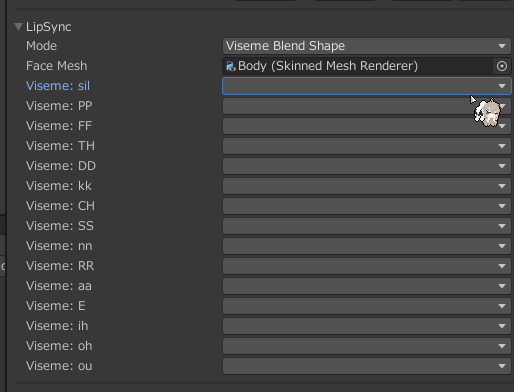

次に，「Eye Look」の折りたたみを開き，その中にある「Eyes」...の中にある「Transform」の折りたたみを開き，  
中にある LeftEye と RightEye をそれぞれ頭側アバターのそれに変更してください。

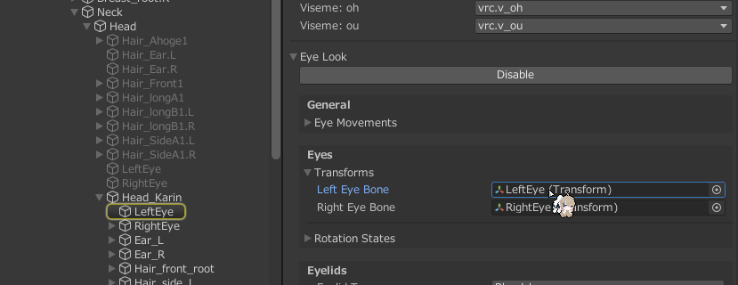

最後に，「Eyelids Mesh」を頭側アバターのメッシュに変更し，「Blendshape States」の折りたたみの中にあるそれぞれのシェイプキーを対応するものに変更してください。

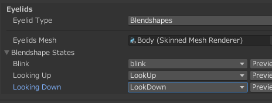

ここまで終われば全て完了です。**お疲れ様でした！**
以降は通常のアバターと同様，服の着せ替えなども行えるはずです。

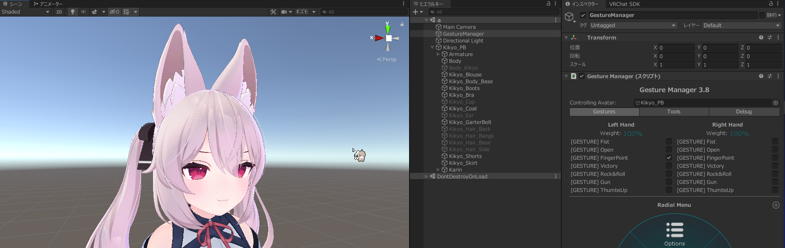

---

[^1]: というかボーンを削除してしまった場合のリカバリーって可能なんでしょうか？
[^2]: 本記事と同様の手順で尻尾のみを移植可能です。この場合は `Armature/Spine/Hips/Tail` を確保すれば問題ないはずです。
[^3]: こだわるなら Photoshop などを用いて元のテクスチャから綺麗に色を揃えた方がいいです。
