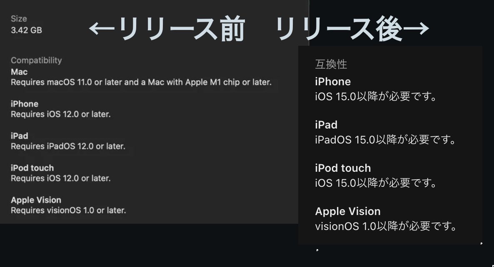
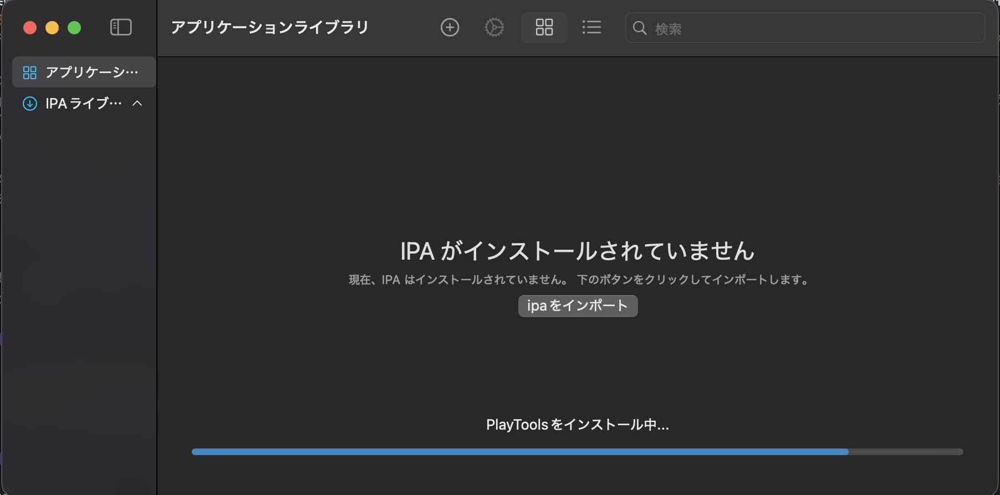
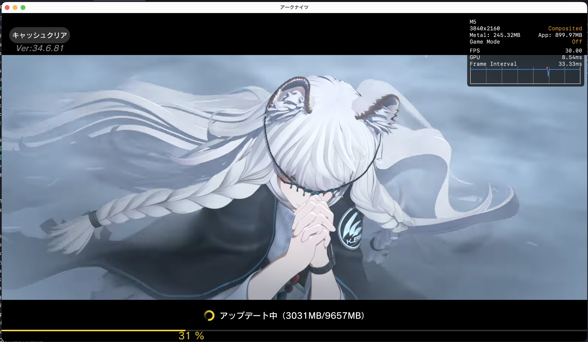
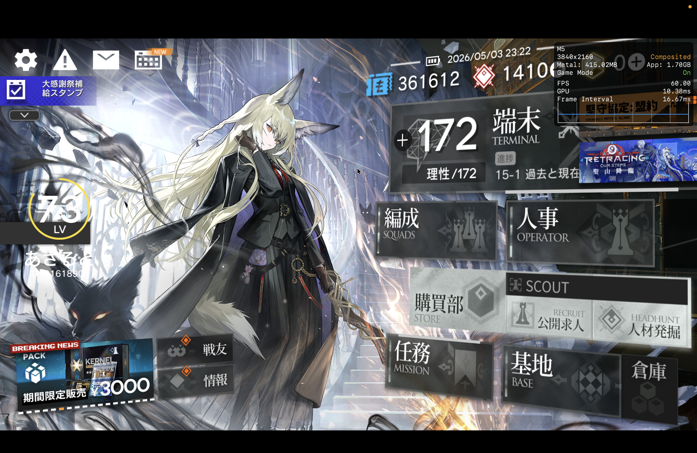

そういえば、 M5 Macbook Air 吊るしモデルを購入しました。  
めちゃんこ快適でいいですね。メモリ 16GB にしてはなんか軽快だし、 Chrome + Discord + VSCode + GIMP + Parsec みたいなことしても全然バッテリー減らんしメモリプレッシャーも緑のまま。どうなってんのこれ。

# まえがき

macOS Catalina 以降には iOS / iPadOS のアプリケーションを動かせる機能が存在しているのですが、**その機能はすべてのアプリケーションで使えるわけではなさそう**なんですよね。  
たとえば、**わたしが好きなスマホゲームの「アークナイツ」は対応していない** (Mac App Storeに存在していない) のですが、**最近リリースの「NTE」や「鳴潮」は対応していたり**と、**結構マチマチ**なようです。

選定基準はある程度あるようですが、**一番優先されるのは「開発者による設定」のようで**、**次点でAppleによる選定? 審査? らしい**です。Redditかなんかで見たので信用してませんが、多分そうだと思います。  
中には、リリース前は macOS 対応だと謳っていたのにリリースしたら対応しなくなっていた、みたいな[事例も存在しています](https://www.reddit.com/r/macgaming/comments/1p358px/arknights_endfield/)。

実際のところ、Mチップ上で macOS も iPadOS も動かせている [^1] ので、**理論上は** macOS でも iPadOS 用のアプリはだいたい全部動かせるし、その逆も行けるはずなんですが、まあ**色々な事情でできないようになっているのではないかな**、と思います [^2] 。  
チップやその上で動いているOSは同じような構造でも、**ハードウェア設計等に絶対的な (そしてカバーのできない) 違いが存在しているので、それを考慮した選定が行われている**んじゃないかなぁ。多分。

とはいえ、**一般ユーザーのわたしとしてはそんなのどうでもいい話**であり、動かせるものが動かせないのはつらいです。かなり。  
Apple M5 とかいう割と強いチップを持っているのにゲームもできないんじゃ宝の持ち腐れもいいところ。せめていつもスマホで遊んでるソシャゲを Macbook Air でできたらよくないですか？と思っていたのですが...  
いつも通り**Twitter**でshitpostの海を漂っていたところ、 [PlayCover](https://playcover.io/) なるものの存在が目に入りました。

なんだこれわ⁉️と思って調べてみると、なんと **Decrypted .ipa を macOS にサイドロードして本来非対応の iOS/iPadOS アプリであっても macOS 上で動かせるようにするもの**じゃないですか❗️  
あまりに顧客が望んでいたものすぎる。

# PlayCoverのつかいかた

以下、 PlayCover を使って本来 macOS 非対応の「アークナイツ」を macOS 上で動かして遊べるようにするまでの記事です。  
といってもだいたいのことは公式ドキュメントとかに載ってるんだけどね。

## 必要なもの

- **Apple Silicon Mac**
  - これがないと始まらないです。M1以降のチップであれば何でも動くはずです。
  - Intel Macの場合は他のエミュを探すとよいと思います。
- **Decrypted な .ipa**
  - 普通の .ipa をどうにかしてインポートするだけじゃだめっぽい。
  - 実機 iPhone を脱獄して入手したりとか色々道はあります。探そう。

## 導入

公式サイトの Download ボタンから Latest dmg を引っ張ってきて普通に入れるだけです。  
たぶん Rosetta 2 も必要になるので事前に入れておくとよいと思います。入れなくても起動したときなんか出てきます。  
Homebrew Cask からも引っ張ってこれるので、お好きな方で。わたしは普通に dmg を引っ張ってきました。

起動したら IPA がないとかなんとか言われてると思うので、 **Decrypted なアークナイツの IPA** をインポートします。  
入手方法は色々あると思うのでここでは割愛。[ところで皆さんあちらの方へ行かれますね](https://decrypt.day/)。当然ながら、外部のソースから引っ張ってくる場合は自己責任で。

インポートが終わったらあとは普通に起動するだけで普通にアークナイツが動きます。すごい！

なんか右上にかっこいいのが写ってるのは Metal HUD のものです。  
`アプリの設定 → その他 → Metal HUD` をオンにすると出せます。

以上です。ゲームとかに限らず大体のアプリがこれで動かせるんじゃないでしょうか。  
実際のプレイ動画とかはそのうち。キーバインドとかも設定できるらしいのでいい感じに設定してあげるとよさそう。

---

[^1]: iPad ProとかMチップで動いてた気がする。逆に Macbook Neo はiPhone 16用のQC落ちA18 Proチップを流用してるとかなんとか。
[^2]: 特に macOS 向けアプリは結構自由度が高い操作ができるので、 iOS / iPadOS との相性は悪そう。