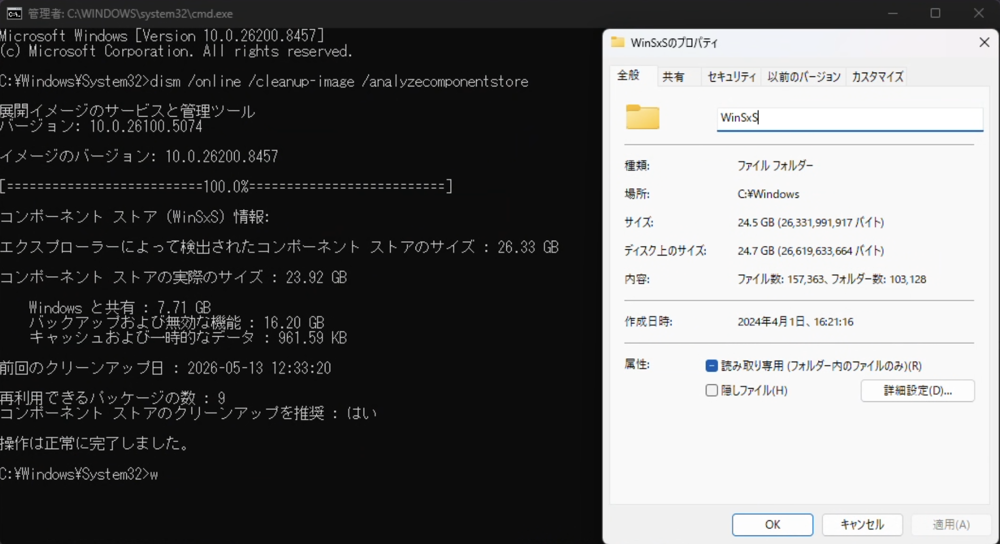
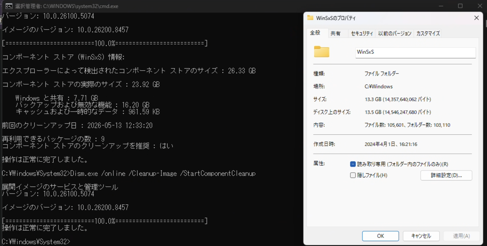

WinSxS フォルダの安全な掃除方法です。  
適当にフォルダをクリックして `Shift-Delete` とかしたらいけないらしいんですよね。 Windows の動作にも結構関わってるらしい。

そして Windows の動作にも関わっているからなのか、**正確なファイルサイズの報告が難しい**とかいう性質も持っている[^1]。キモ

ということでまずは正確なファイルサイズをしらべてゆく。  
Microsoft Learn を参考に、以下のコマンドで WinSxS フォルダを調べてもらう。
https://learn.microsoft.com/ja-jp/windows-hardware/manufacture/desktop/determine-the-actual-size-of-the-winsxs-folder

```cmd
C:\Windows\System32>Dism.exe /Online /Cleanup-Image /AnalyzeComponentStore

展開イメージのサービスと管理ツール
バージョン: 10.0.26100.5074

イメージのバージョン: 10.0.26200.8457

[==========================100.0%==========================]

コンポーネント ストア (WinSxS) 情報:

エクスプローラーによって検出されたコンポーネント ストアのサイズ : 26.33 GB

コンポーネント ストアの実際のサイズ : 23.92 GB

    Windows と共有 : 7.71 GB
    バックアップおよび無効な機能 : 16.20 GB
    キャッシュおよび一時的なデータ : 961.59 KB

前回のクリーンアップ日 : 2026-05-13 12:33:20

再利用できるパッケージの数 : 9
コンポーネント ストアのクリーンアップを推奨 : はい

操作は正常に完了しました。
```



んまあ大体同じぐらいに見える。エクスプローラーから見た値がちょっとでかく見えるのは先に上げた仕様によるものっぽい。

この場合、**最大で**[^2]消せるサイズは `23.92 GB` と見える (=24GBぐらい空くように見える) かもしれないが、実際はそんなことない。 `Windows と共有` の部分の値も含まれており、ここも消すと Windows も怪しくなってしまうため。  
実際は `バックアップおよび無効な機能 + キャッシュおよび一時的なデータ` を足した値が消せるサイズ分となり、この場合**最大で**[^2]大体 `17 GB` となる。

いい感じに空いてくれそうなことがわかったので、実際に削除コマンドを実行する。手動で削除とかしたらダメよ  
削除コマンド自体は簡単で、適当にぺっと貼り付けて実行するだけ。

```cmd
C:\Windows\System32>Dism.exe /online /Cleanup-Image /StartComponentCleanup

展開イメージのサービスと管理ツール
バージョン: 10.0.26100.5074

イメージのバージョン: 10.0.26200.8457

[==========================100.0%==========================]
操作は正常に完了しました。
```



実行前と実行後で比較すると `11.2 GB` ぐらい解放されたことになる。  
この Windows は 2025/07/08 にインストールしたものなので、大体1年ぐらいしか使っていないがそれでも `11 GB` ぐらいは削除可能ファイルが残存していることがわかった。

数年レベルでお掃除してなかったりする Windows 環境があるなら試してみてもいいかもしれない。  
ただクリーンアップ自体は大型アップデートとか、あるいはランダムなタイミングでも走りそうなのでびっくりするほどゴミが溜まってるってことはないかもなぁ。

---

[^1]: WinSxSフォルダ内に色々なプログラムがハードリンクされていることがあり、結果的に報告されるファイルサイズが2倍になることがあるようだ。
[^2]: なんでこんな書き方をしているのかというと、すべてのファイルが削除可能なわけではないため。