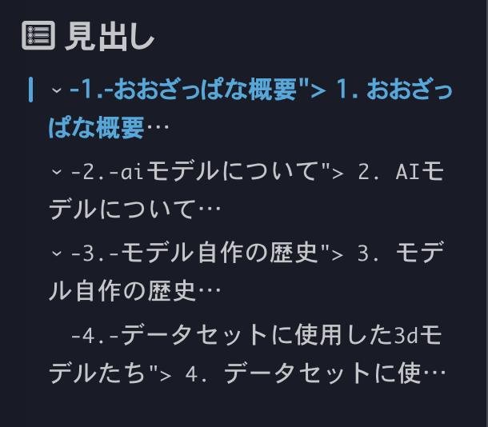

タイトルの通りです。SSG [^1] を Hexo から Astro に変えてみました。

どちらも Node.js 製であることと、パフォーマンス自体はそんなに変わらなさそう? な上に、コロコロ変えるとまた色々覚え直したり GitHub Actions を書き直したりとかやらなきゃいけなくて結構コストが高いのですが、それらを受け入れてまで変えた理由を少しだけ書きます。

採用したものは **Astro Framework + Fuwari Theme** です。
::github{repo="saicaca/fuwari"}

## そもそもSSGって何よ

人によって色々違いはあると思いますが、自分は「**Markdownファイルをもとに規定のルールに則ってHTMLファイルを生成するフレームワーク**」だと思っています。  
いい感じにMarkdownを書くといい感じにHTMLが吐き出されて嬉しい、的な。ついでにいい感じのテーマっぽくなってると更に嬉しいです。

「静的な」というのが重要で、動的なコンテンツを生成したりしようとすると結構面倒だったりします。ちょっと重たいとか。  
動的コンテンツを提供したいならともかく、わたしはそんな手の込んだことはしたくないので、そんなのを被る必要性はどこにもありません。  
ということでクソ昔から色々なSSGを試してみたりしています [^2] 。HTML + CSSベタ書きとかもやってます。

### なんで変えたのよ

きっかけはまじでしょうもなくて、 **dependabot の言う通りにPR Mergeしてパッケージアプデしたら壊れた**からです [^3] 。  

問題解決のために色々やるぐらいなら、**前々からフレームワーク新しいのにしたかったしこの機会に変えちゃうか！ｗ**みたいなノリで変えてみました。

選定先は複数あったのですが、なんか見た目がいい感じなのと身の回りの **† 𝙏𝙚𝙘𝙝 𝙊𝙩𝙖𝙠𝙪 †** の方々がみな Astro + Fuwari Theme の構成で作っていたので自分もそれに倣うことにしました。  
もともと Fuwari Fork? の [Yukina](https://github.com/WhitePaper233/yukina) を試していたのですが、なんか挙動が色々怪しかったりで大人しく Fuwari に戻した感じです。

## でAstroってどうよ

まだガイドとかドキュメントを見漁りつつ書いてみてる段階ですが、現時点ではめっちゃいい感じです。  
Devサーバーの立ち上がりが早かったり、ドキュメントが結構充実してて嬉しいポイントが多い。

Markdownほぼベタ書きでもいい感じに記事の体裁を整えられるほか、Fuwari拡張によっていい感じに埋め込みとかシンタックスハイライトとか実装されています。  
このページの一番上にあるGitHubのカードみたいなのがそうです。

特にカスタマイズなどは行っていません。最低限の config 編集ぐらいで収まっているはずです。  
というかカスタマイズを行った結果 Hexo でちょっとしんどい目を見ているので、今回はほぼほぼバニラの状態でいい感じに運用してみようかなぁと。  
最近はいい感じSSGも出尽くしている感があるので、できればこれで更新を止めて維持に努めていきたい所存です。

:::important
ただし一個だけ注意が必要です。  
`src/layouts/MainGridLayout.astro` 4行目 import のファイル名 `Navbar.astro` を `NavBar.astro` にしないとLinuxベースのCIで落ちます。カス
:::

---

[^1]: Static Site Generator 、静的サイト
[^2]: このサイトのGitHub リポジトリを漁るとわかるのですが、いろんなSSGから乗り換えたりしてます。確認できる限りではJekyll→Hexo→Astroでしょうか。
[^3]: dependabot に罪をなすりつけていますが、多分悪いのはわたしです。目次機能の実装のために入れてたプラグインと最新バージョンが非互換だったかもしれません。